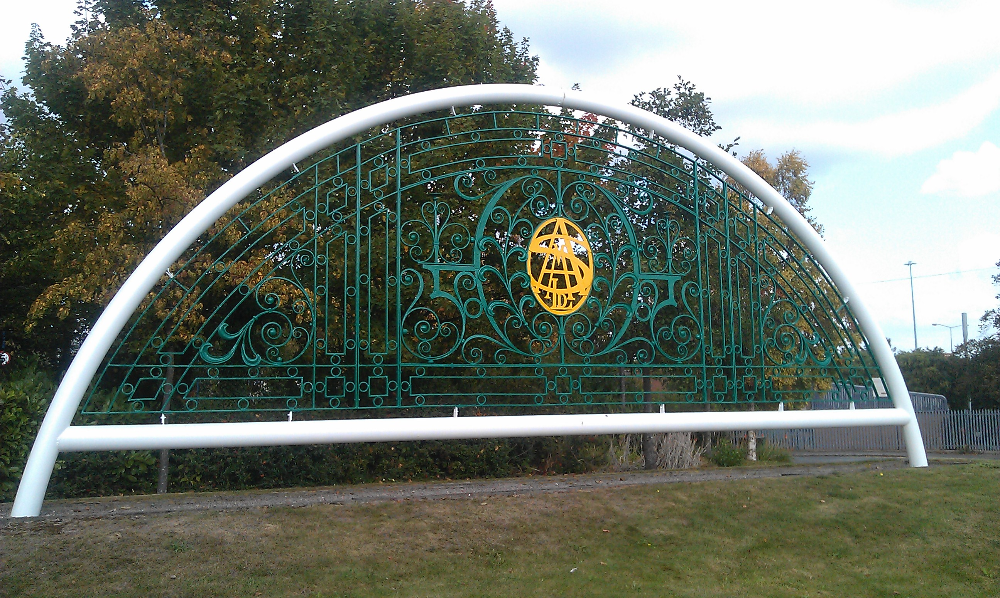
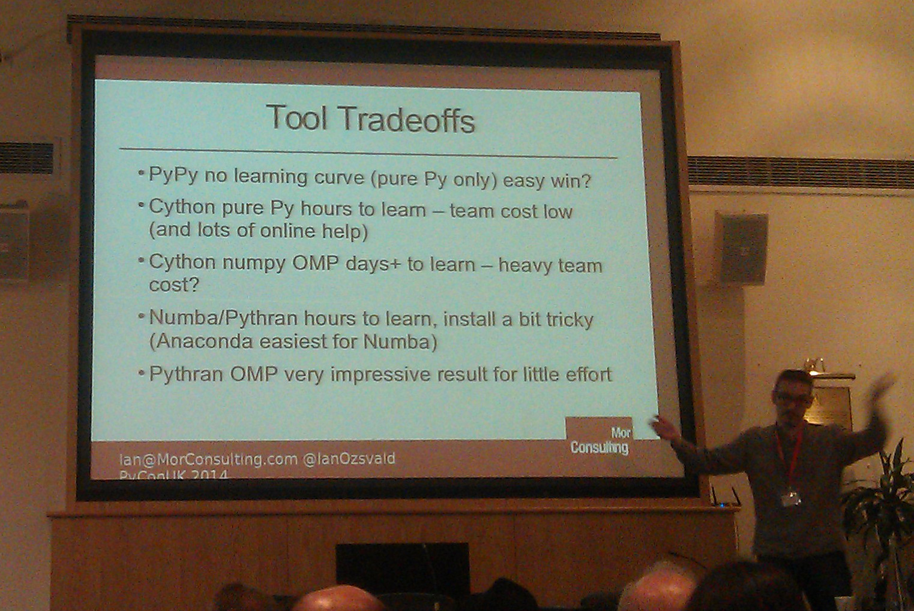
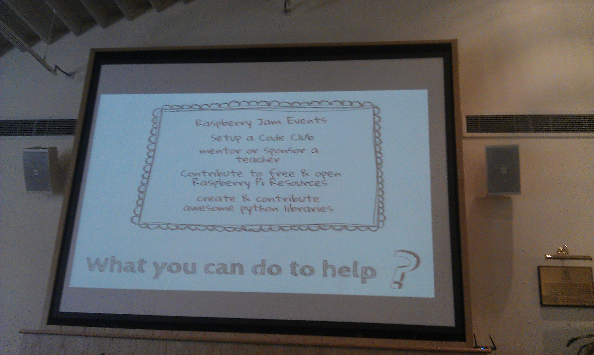
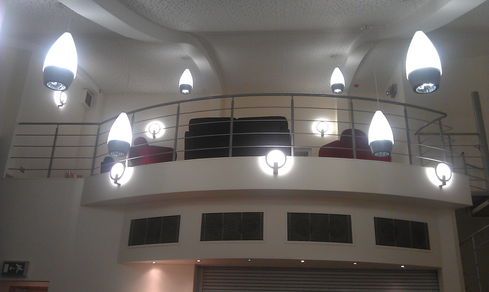
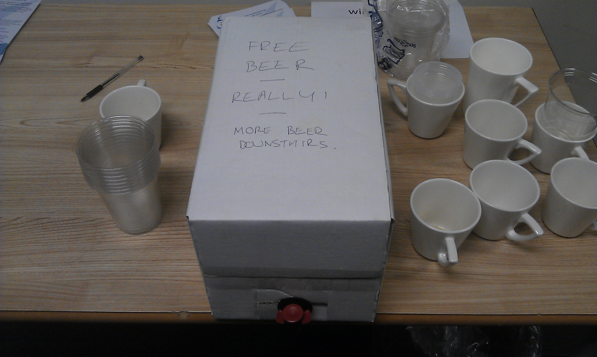
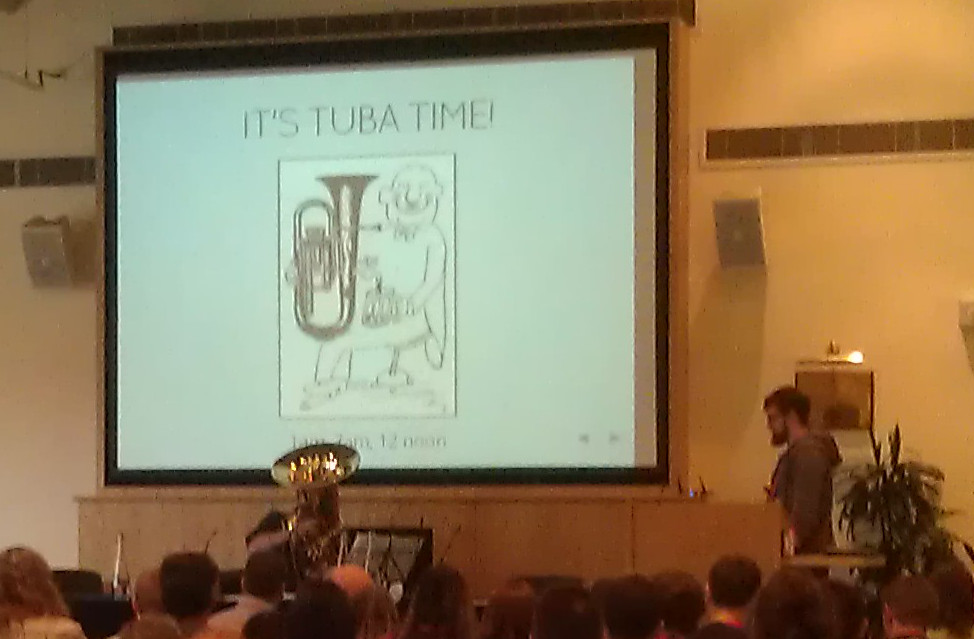
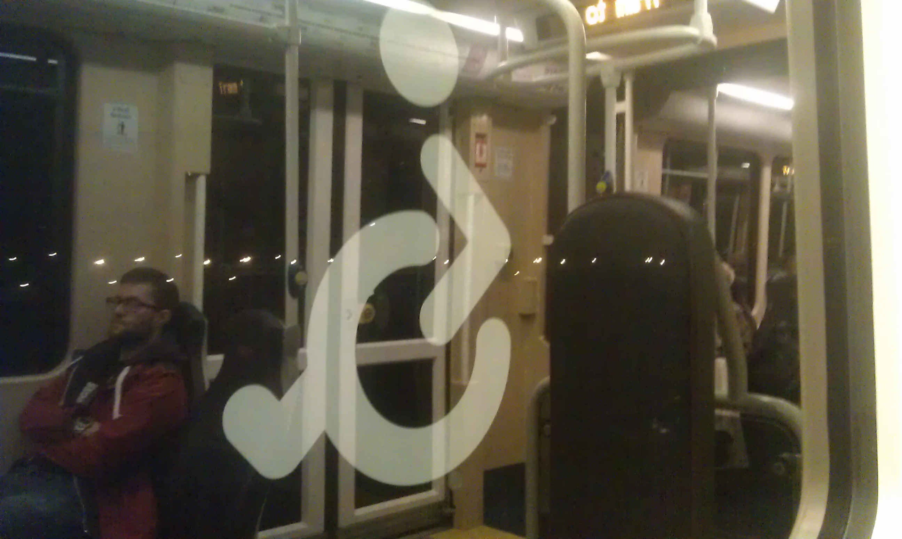

Cool stuff I saw at PyCon UK 2014
=================================
* Miles Gould <miles.gould@hogarthww.com>
* 26th September 2014

Major themes
============

* Scientific computing
* Education
* Big picture

Scientific computing
====================
* `Ganga <https://ep2014.europython.eu/en/schedule/sessions/54/>`_
* `Plotly <http://plot.ly>`_
* Profiling
* PyPy, Numba, Cython, Pythran, ShedSkin...

Education
=========
* Raspberry Pi
* Minecraft
* Robots!
* Awesome keynote by Carrie-Ann Philbin

Debugging tools
===============
* `ispyd`_/`pyrasite`_ - inject code into running process
* `mitmproxy`_
* `pathod/pathoc <http://pathod.net/docs/pathod>`_

.. _ispyd: https://pypi.python.org/pypi/ispyd/0.0.0
.. _pyrasite: https://github.com/lmacken/pyrasite
.. _mitmproxy: http://mitmproxy.org/doc/mitmproxy.html

Profiling tools
===============
* `cProfile`_ + `RunSnakeRun`_
* `line_profiler`_
* `memory_profiler`_
* `iotop <http://guichaz.free.fr/iotop/>`_

.. _cProfile: https://docs.python.org/2/library/profile.html
.. _RunSnakeRun: http://www.vrplumber.com/programming/runsnakerun/
.. _line_profiler: https://github.com/rkern/line_profiler
.. _memory_profiler: https://pypi.python.org/pypi/memory_profiler

Development tools
=================
* `Rope`_/`Traad`_ - refactoring support
* `Ag <https://github.com/ggreer/the_silver_searcher>`_ - fast code searcher
* `direnv <https://github.com/zimbatm/direnv>`_ - load env on directory change
* `weld <https://code.google.com/p/weld/>`_ - manage git vendor branches
* `pyfakefs <http://code.google.com/p/pyfakefs/>`_ - test file manipulation
* 2to3

.. _Rope: http://rope.sourceforge.net/
.. _Traad: https://github.com/abingham/traad

Cool libraries
==============
* `Bottle`_ - ultra-simple web framework
* `Pykka`_ - actors in Python
* `requests-toolbelt`_
* (`more`_-)
  `itertools`_
* PySerial
* TastyPie

.. _Bottle: http://bottlepy.org/docs/dev/index.html
.. _Pykka: https://github.com/jodal/pykka
.. _requests-toolbelt: https://pypi.python.org/pypi/requests-toolbelt/0.3.0
.. _more: https://github.com/erikrose/more-itertools
.. _itertools: https://docs.python.org/2/library/itertools.html

Last but not least
==================
* `rst2html5 <https://github.com/marianoguerra/rst2html5>`_
* Used to make these slides!
* Installation currently slightly fiddly

Best Things I Saw
=================
* Lessons from Strangers (Rachel Sanders)
* The Twelve-Factor App (Kristian Glass)
* Miss Adventures in Raspberry Pi (Carrie Anne Philbin)
* A Deep Dive into Requests (Cory Benfield)
* How does a Spreadsheet Work (Harry Percival)
* Micro Python - my experiences running a successful Kickstarter campaign (Damien George)

Things I Wish I'd Seen
======================
* Farewell and Welcome Home: Python in Two Genders (Naomi Ceder)
* HTTP/2: Because The Web Was Too Easy (Cory Benfield)
* Dockerize your Python App (James Pacileo)
* The entire Education track

Upcoming conferences
====================

- DjangoCon Europe
  - 2nd-7th June, Cardiff
- Python Namibia 2015
  - 2nd-5th Feb, Windhoek
  - http://python-namibia.org/
- PyCon UK 2015
  - Same bat-week, same bat-place

Thanks for listening!
=====================

